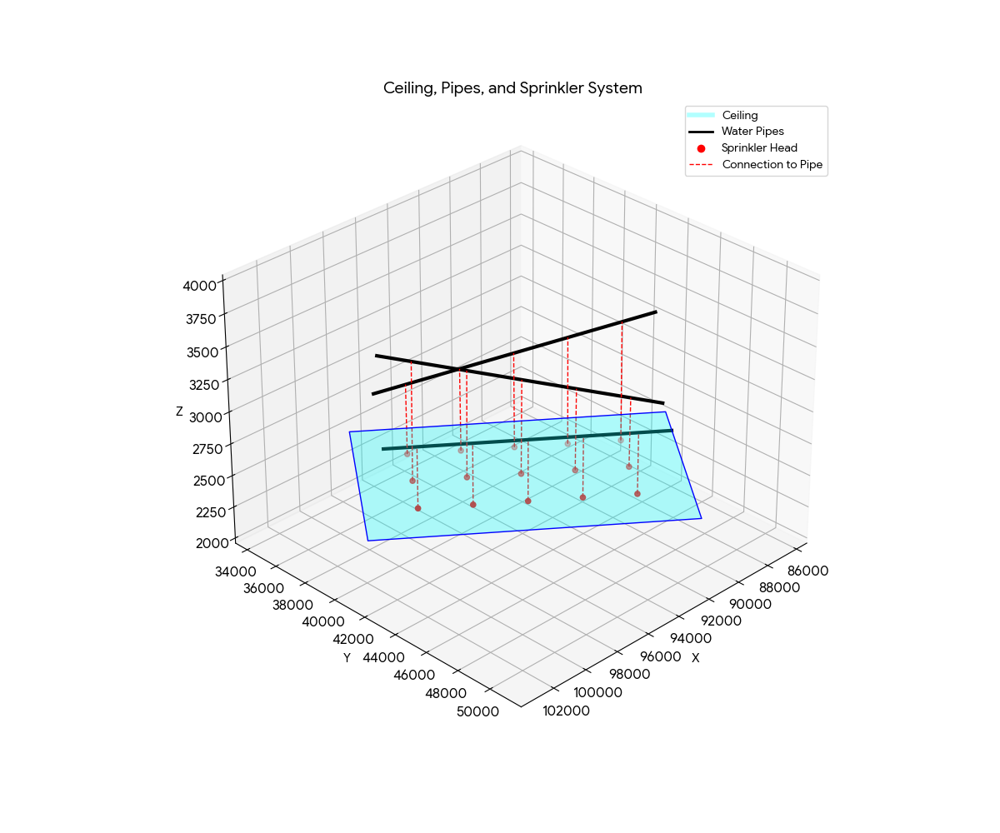

# Tandm Programming Challenge - Sprinkler System Solution

## Problem Description

Calculate the number of sprinklers required to fill a room, their positions on the ceiling, and connect each sprinkler to the nearest water pipe.

### Input Data

**Ceiling Corners (clockwise):**
| Point | X | Y | Z |
|-------|------|------|------|
| P1 | 97500.01 | 34000.00 | 2500.00 |
| P2 | 85647.67 | 43193.61 | 2500.00 |
| P3 | 91776.75 | 51095.16 | 2530.00 |
| P4 | 103629.07 | 41901.55 | 2530.00 |

**Water Pipes:**
| Pipe | Start (X, Y, Z) | End (X, Y, Z) |
|------|-----------------|---------------|
| P1 | (98242.11, 36588.29, 3000.00) | (87970.10, 44556.09, 3500.00) |
| P2 | (99774.38, 38563.68, 3500.00) | (89502.37, 46531.47, 3000.00) |
| P3 | (101306.65, 40539.07, 3000.00) | (91034.63, 48507.01, 3000.00) |

**Constraints:**
- Sprinklers must be **2500mm from walls**
- Sprinklers must be **2500mm apart** from each other

---

## Mathematical Formulas

### 1. 3D Distance Formula
Used to calculate edge lengths and distances between points:
```
d = √[(x₂-x₁)² + (y₂-y₁)² + (z₂-z₁)²]
```

### 2. Unit Direction Vectors
Calculate normalized direction vectors along ceiling edges:
```
û₁₂ = (P2 - P1) / |P1P2|

unit_12_x = (P2.X - P1.X) / len_12
unit_12_y = (P2.Y - P1.Y) / len_12
```

### 3. Sprinkler Count Calculation
Number of sprinklers along each edge:
```
available_length = edge_length - 2 × margin
count = floor(available_length / spacing) + 1
```

### 4. Grid Position (Vector Addition)
Calculate sprinkler X,Y coordinates using parametric position:
```
X = P1.X + d₁₂ × û₁₂.x + d₁₄ × û₁₄.x
Y = P1.Y + d₁₂ × û₁₂.y + d₁₄ × û₁₄.y

where:
  d₁₂ = distance along edge P1→P2
  d₁₄ = distance along edge P1→P4
```

### 5. Bilinear Interpolation (Z Coordinate)
Handle sloped ceiling by interpolating Z from all 4 corners:
```
Z = (1-u)(1-v)×Z₁ + u(1-v)×Z₂ + uv×Z₃ + (1-u)v×Z₄

where:
  u = d₁₂ / len_12  (parametric position along P1→P2)
  v = d₁₄ / len_14  (parametric position along P1→P4)
```

### 6. Point-to-Line Segment Projection
Find nearest connection point on a pipe:
```
Given: Point P, Pipe segment from A to B

AB = B - A           (pipe direction vector)
AP = P - A           (vector from pipe start to sprinkler)

t = (AP · AB) / (AB · AB)    (projection factor)
t = clamp(t, 0, 1)           (constrain to segment)

Connection = A + t × AB      (nearest point on pipe)
```

---

## Project Structure

```
SprinklerSystem/
├── SprinklerSystem.sln
├── README.md
└── src/
    └── SprinklerSystem/
        ├── Point.cs                    # 3D coordinate (readonly record struct)
        ├── WaterPipe.cs                # Pipe with ID, Start, End points
        ├── SprinklerPlacement.cs       # Result: Position + ConnectionPoint + PipeID
        ├── CeilingGeometryService.cs   # Grid generation & pipe projection logic
        ├── SprinklerLayoutService.cs   # Main calculation orchestrator
        ├── Program.cs                  # Entry point with input data
        └── SprinklerSystem.csproj
```

### Class Descriptions

| Class | Responsibility |
|-------|----------------|
| `Point` | Immutable 3D coordinate with Distance() method |
| `WaterPipe` | Represents a pipe segment with start/end points |
| `SprinklerPlacement` | Holds sprinkler position and its pipe connection |
| `CeilingGeometryService` | Generates grid positions, calculates pipe connections |
| `SprinklerLayoutService` | Orchestrates the calculation workflow |

---

## How to Run

```bash
cd src/SprinklerSystem
dotnet run
```

## Sample Output

**Number of Sprinklers: 15**

| # | Sprinkler Position (X, Y, Z) | Connection Point (X, Y, Z) |
|---|------------------------------|----------------------------|
| 1 | (97056.88, 37507.65, 2507.50) | (97073.58, 37494.70, 3056.88) |
| 2 | (95081.49, 39039.91, 2507.50) | (95101.11, 39024.70, 3152.89) |
| 3 | (93106.10, 40572.18, 2507.50) | (93128.64, 40554.71, 3248.90) |
| 4 | (91130.72, 42104.45, 2507.50) | (91156.17, 42084.71, 3344.91) |
| 5 | (89155.33, 43636.71, 2507.50) | (89183.70, 43614.72, 3440.93) |
| 6 | (98589.14, 39483.03, 2515.00) | (98561.01, 39504.87, 3440.94) |
| 7 | (96613.75, 41015.29, 2515.00) | (96588.54, 41034.87, 3344.93) |
| 8 | (94638.36, 42547.56, 2515.00) | (94616.07, 42564.88, 3248.91) |
| 9 | (92662.98, 44079.83, 2515.00) | (92643.60, 44094.88, 3152.90) |
| 10 | (90687.59, 45612.09, 2515.00) | (90671.13, 45624.88, 3056.89) |
| 11 | (100121.40, 41458.41, 2522.50) | (100121.43, 41458.44, 3000.00) |
| 12 | (98146.01, 42990.67, 2522.50) | (98146.05, 42990.73, 3000.00) |
| 13 | (96170.62, 44522.94, 2522.50) | (96170.68, 44523.01, 3000.00) |
| 14 | (94195.23, 46055.21, 2522.50) | (94195.30, 46055.30, 3000.00) |
| 15 | (92219.85, 47587.47, 2522.50) | (92219.93, 47587.58, 3000.00) |

---

## Visualization



The 3D visualization shows:
- **Cyan surface**: Room ceiling (slightly sloped, Z varies from 2500 to 2530)
- **Black lines**: Three water pipes above the ceiling
- **Red dots**: Sprinkler head positions on the ceiling
- **Red dashed lines**: Connections from each sprinkler to nearest pipe

---

## Algorithm Summary

1. **Calculate ceiling edge lengths** using 3D distance formula
2. **Determine sprinkler grid dimensions** based on margin (2500mm) and spacing (2500mm)
3. **Generate sprinkler positions** using vector addition for X,Y and bilinear interpolation for Z
4. **For each sprinkler**, project onto all pipes and find the nearest connection point
5. **Output** each sprinkler position with its corresponding pipe connection

---

## Technologies

- C# / .NET Core
- No external dependencies
